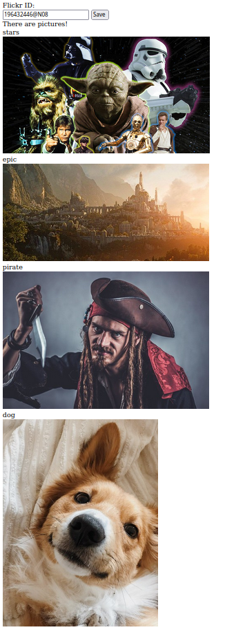

# Flickr API

This project was created to practice accessing an API.

### Functionality

* Users can retrieve another user's photos in their public photostream by entering their Flickr ID
* Uses Figaro gem to keep the Flickr API key and secret private and secure

### Screenshot

